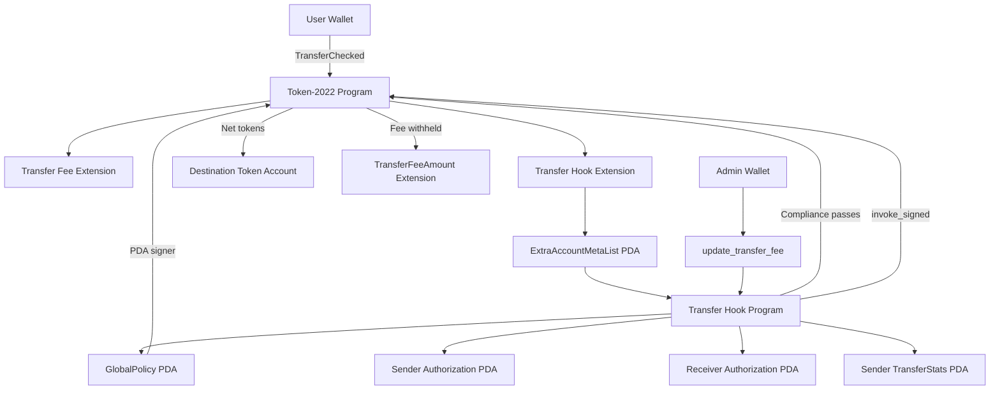

# Token-2022 Compliance & Dynamic Fee Engine

A programmable compliance and dynamic transfer-fee protocol built on **Solana Token-2022** using **Rust, Anchor, Transfer Hooks, ExtraAccountMetaList PDAs, wallet-level compliance state, and PDA-controlled Token-2022 fee authority**.

The project demonstrates how an institutional-style token can enforce transfer restrictions on-chain while still using Token-2022's native token and transfer-fee infrastructure.

> **Status:** Deployed and working on Solana Devnet.  
> **Network:** Devnet  
> **Frontend:** Live on Vercel  
> **Security:** Educational/portfolio deployment. Not audited and not intended for mainnet use.

---

## Live Demo

**Frontend**

https://token2022-compliance.vercel.app

**Solana Program**

```text
Bzf35ZWCmtpzrYxQRd3y6x73NDHASarXkxK3RmFsmsW6
```

**Token-2022 Mint**

```text
CqLtUZQBK9phoD33ye6sQQG2EdoMrEvraHgijwpy9ZDF
```

**GlobalPolicy PDA**

```text
EmoBiCLorusZGANzxWfhb2brvTMu2pQFGMquxu466Yh8
```

---

## What This Project Solves

Standard token transfers mainly enforce rules defined by the token program itself.

Real-world and institutional assets often require additional policy:

- Is the sender authorized?
- Is the receiver authorized?
- Is either wallet blocked?
- Is the protocol currently enabled?
- Has the transfer exceeded the per-transaction maximum?
- Has the sender exceeded a daily transfer limit?
- Should a dynamic transfer fee apply?
- Can the admin change the fee directly, or must changes pass through protocol governance?

This project implements those controls directly in the token transfer lifecycle using **Token-2022 Transfer Hooks**.

---

## Core Features

- Token-2022 mint with **Transfer Hook**
- Token-2022 native **Transfer Fee extension**
- On-chain wallet authorization
- `Authorized`, `Unauthorized`, and `Blocked` wallet states
- Maximum transfer amount enforcement
- Wallet-level daily transfer limits
- Lifetime transfer statistics
- Daily transfer accounting
- Global policy enable/disable control
- Optional policy expiry
- Dynamic transfer-fee updates
- PDA-controlled `TransferFeeConfig` authority
- `invoke_signed` CPI into Token-2022
- ExtraAccountMetaList account resolution
- Canonical PDA validation
- Protection against account substitution
- Protection against direct Transfer Hook invocation
- Delegate-aware wallet identity handling
- Atomic rollback when compliance validation fails
- React + TypeScript frontend
- Wallet connection
- Live Devnet protocol dashboard
- Compliance-state dashboard
- Real browser-signed Token-2022 transfers
- Admin control interface
- Vercel deployment with server-side RPC proxy

---

# Architecture



---

# Transfer Flow

A normal successful transfer follows this path:

```text
User signs transaction
        ↓
Token-2022 TransferChecked
        ↓
Token-2022 reads TransferHook extension
        ↓
ExtraAccountMetaList resolves required accounts
        ↓
Transfer Hook CPI
        ↓
GlobalPolicy validation
        ↓
Sender Authorization validation
        ↓
Receiver Authorization validation
        ↓
Per-transfer limit validation
        ↓
Daily transfer limit validation
        ↓
TransferStats updated
        ↓
Hook returns Ok
        ↓
Token-2022 completes transfer
        ↓
Native Transfer Fee applied
```

If any compliance rule fails, the transaction is rejected atomically.

Token balances, withheld fees, and compliance statistics remain unchanged.

---

# Token-2022 Extensions

The Devnet mint uses two important Token-2022 extensions.

## Transfer Hook

The mint contains a Transfer Hook configuration pointing to:

```text
Bzf35ZWCmtpzrYxQRd3y6x73NDHASarXkxK3RmFsmsW6
```

During a Token-2022 transfer, the token program invokes the compliance program.

The hook validates policy and wallet state before allowing the transfer to finish.

## Transfer Fee

Transfer fees use Token-2022's native `TransferFeeConfig`.

The project does **not** implement custom fee mathematics inside the hook.

Token-2022 itself calculates and withholds the fee.

Example:

```text
Gross transfer: 40 tokens
Fee:            1%
Withheld:       0.4 tokens
Receiver gets:  39.6 tokens
```

A dynamic fee update from `1%` to `2%` was also successfully scheduled through the protocol's PDA-controlled authority path.

---

# Dynamic Fee Architecture

The important security property is that the administrator is **not** the final Token-2022 transfer-fee authority.

The mint's `TransferFeeConfig` authority was transferred to the `GlobalPolicy` PDA.

```text
Admin Wallet
      ↓
update_transfer_fee
      ↓
Compliance Program
      ↓
invoke_signed
      ↓
GlobalPolicy PDA
      ↓
Token-2022 SetTransferFee
```

The PDA is:

```text
EmoBiCLorusZGANzxWfhb2brvTMu2pQFGMquxu466Yh8
```

This means a direct wallet-level attempt to modify the transfer fee does not satisfy the Token-2022 fee-authority requirement.

Only the compliance program can produce the PDA signature using the correct seeds.

---

# On-Chain State

## GlobalPolicy

Stores protocol-wide compliance configuration.

```rust
pub struct GlobalPolicy {
    pub admin: Pubkey,
    pub mint: Pubkey,
    pub enabled: bool,
    pub max_transfer_amount: u64,
    pub daily_transfer_limit: u64,
    pub policy_version: u64,
    pub expires_at: i64,
    pub bump: u8,
}
```

PDA:

```text
["policy", mint]
```

Current Devnet configuration was initialized with:

```text
Max transfer: 100 tokens
Daily limit:  250 tokens
Policy:       Enabled
```

---

## Authorization

Stores compliance status for a wallet.

```rust
pub struct Authorization {
    pub mint: Pubkey,
    pub wallet: Pubkey,
    pub status: AuthorizationStatus,
    pub bump: u8,
}
```

PDA:

```text
["authorization", mint, wallet]
```

Statuses:

```text
Unauthorized
Authorized
Blocked
```

Authorization is wallet-level rather than token-account-level.

---

## TransferStats

Stores compliance accounting for a wallet.

```rust
pub struct TransferStats {
    pub mint: Pubkey,
    pub wallet: Pubkey,
    pub day_index: i64,
    pub amount_today: u64,
    pub total_transferred: u64,
    pub transfer_count: u64,
    pub bump: u8,
}
```

PDA:

```text
["stats", mint, wallet]
```

Daily accounting uses a UTC day index derived from Unix time.

This prevents a wallet from bypassing daily limits by simply creating multiple token accounts.

---

# Why Wallet-Level Compliance Matters

A Solana wallet may control multiple Token-2022 token accounts.

If limits were attached only to token accounts, a user could potentially create another token account and reset their daily allowance.

This protocol identifies the sender and receiver using the internal owner stored in their Token-2022 accounts and then applies compliance state to the wallet itself.

```text
Wallet
 ├── Token Account A
 ├── Token Account B
 └── Token Account C

        ↓

Single wallet-level TransferStats PDA
```

All token accounts controlled by the same wallet therefore share the same compliance statistics.

---

# ExtraAccountMetaList

Token-2022 needs to know which additional accounts must be passed to the Transfer Hook.

The protocol uses an `ExtraAccountMetaList` PDA.

```text
Token Transfer
      ↓
Token-2022
      ↓
ExtraAccountMetaList
      ↓
Resolves:
    GlobalPolicy
    Sender Authorization
    Receiver Authorization
    Sender TransferStats
```

The ExtraAccountMetaList is used for **account resolution**, not trust.

The Transfer Hook independently validates that all supplied accounts are the canonical PDAs expected by the protocol.

This protects against account substitution attacks.

---

# Transfer Hook Security

The hook includes several defensive checks.

It verifies:

```text
Mint has the correct TransferHook extension
TransferHook program ID equals this program
Source token account is actively transferring
Destination token account is actively transferring
GlobalPolicy PDA is canonical
Authorization PDAs are canonical
TransferStats PDA is canonical
Policy is enabled
Policy is not expired
Sender is authorized
Receiver is authorized
Wallet is not blocked
Transfer amount is within the maximum
Daily transfer limit is not exceeded
Arithmetic does not overflow
```

The `TransferHookAccount.transferring` flag is also checked.

This helps prevent a malicious user from directly invoking the hook instruction outside a genuine Token-2022 transfer.

---

# Dynamic Policy Engine

Policy parameters can be modified without redeploying the program.

Supported dynamic changes include:

```text
Policy enabled / disabled
Maximum transfer amount
Daily transfer limit
Policy expiration
Transfer fee basis points
Maximum Token-2022 transfer fee
```

Each policy or fee update increments:

```text
policy_version
```

This provides a simple on-chain version history indicator for configuration changes.

---

# Frontend

The project includes a complete React + TypeScript frontend.

Live:

https://token2022-compliance.vercel.app

The interface includes five major sections.

### Dashboard

Displays live Devnet state:

```text
Current Token-2022 fee
Upcoming transfer fee
Fee activation epoch
Current Solana epoch
Policy enabled/disabled
Policy version
Maximum transfer amount
Daily transfer limit
Connected-wallet balance
Mint supply
Fee authority
```

### Transfer

Allows an authorized wallet to execute a real Token-2022 transfer.

The frontend:

```text
Accepts recipient wallet
Derives Token-2022 ATA
Creates recipient ATA if necessary
Builds TransferChecked instruction
Resolves Transfer Hook extra accounts
Requests wallet signature
Submits signed transaction through Devnet RPC
Waits for confirmation
Displays Explorer transaction link
```

### Compliance

Displays the connected wallet's:

```text
Authorization status
Amount transferred today
Lifetime transferred amount
Transfer count
UTC day index
```

### Admin

Contains interfaces for:

```text
Wallet authorization
Wallet blocking
Global policy updates
Dynamic Token-2022 fee updates
Devnet demo minting
```

Admin controls remain disabled unless the connected wallet matches the on-chain policy administrator.

The sensitive admin wallet is intentionally not required for the public demo.

### Architecture

Provides a visual explanation of:

```text
Wallet
→ Token-2022
→ ExtraAccountMetaList
→ Transfer Hook
→ Policy / Authorization / Stats PDAs
```

---

# Frontend RPC Security

Local development may use:

```env
VITE_RPC_URL=<DEVNET_RPC>
```

However, `VITE_*` variables are public in browser bundles.

The deployed application therefore uses a Vercel server-side RPC proxy.

```text
Browser
   ↓
/api/rpc
   ↓
Vercel Server Function
   ↓
HELIUS_DEVNET_RPC
   ↓
Solana Devnet
```

The production Helius RPC URL is stored as a Vercel server environment variable rather than exposing the API key directly to the browser bundle.

---

# Devnet Validation

The protocol has been validated with real Devnet transactions.

## Successful transfer

A real transfer of:

```text
40 tokens
```

was executed with a `1%` native Token-2022 transfer fee.

Observed result:

```text
Sender:
1000 → 960

Receiver spendable:
+39.6

Receiver withheld:
+0.4

Sender TransferStats:
amount_today      = 40
total_transferred = 40
transfer_count    = 1
```

A second successful transfer was also executed through the deployed browser frontend.

The browser sender state changed:

```text
Balance:
100 → 60

TransferStats:
amount_today      = 40
total_transferred = 40
transfer_count    = 1
```

This proves that the complete browser-to-program path works:

```text
Browser Wallet
→ Vercel Frontend
→ Solana RPC
→ Token-2022
→ ExtraAccountMetaList
→ Transfer Hook
→ Compliance Accounts
→ Transfer Fee
```

---

## Maximum Transfer Rejection

The policy maximum was configured as:

```text
100 tokens
```

A transfer of:

```text
101 tokens
```

was attempted.

The Transfer Hook rejected the transfer with:

```text
Error Code:
MaxTransferAmountExceeded

Error Number:
6010
```

After rejection:

```text
Sender balance unchanged
Receiver balance unchanged
Withheld fee unchanged
TransferStats unchanged
```

This demonstrates Solana's atomic transaction rollback with compliance enforcement.

---

## Dynamic Fee Update

The native Token-2022 transfer fee was initially:

```text
100 basis points = 1%
```

The admin called the compliance program's:

```text
update_transfer_fee
```

instruction.

The program then invoked Token-2022 using:

```text
invoke_signed
```

with the GlobalPolicy PDA.

The new fee was scheduled as:

```text
200 basis points = 2%
Maximum fee      = 5 tokens
```

Token-2022 schedules transfer-fee changes by epoch rather than applying them immediately.

The frontend displays both:

```text
Current fee
Upcoming fee
Activation epoch
```

---

## Direct Fee-Control Bypass Protection

A direct attempt to update Token-2022's fee using the admin wallet was rejected because the wallet is no longer the mint's `TransferFeeConfig` authority.

Configured authority:

```text
EmoBiCLorusZGANzxWfhb2brvTMu2pQFGMquxu466Yh8
```

Provided wallet:

```text
J2GL63eJnVsmJipKkFiaLvwrdSiGnfj5ESpa1HcJXS2G
```

The fee update succeeds only when routed through the compliance program, which signs as the GlobalPolicy PDA.

---

# Tested Scenarios

The integration test suite and Devnet validation cover:

1. Successful compliant transfer
2. Native Token-2022 transfer fees
3. Sender authorization
4. Receiver authorization
5. Blocked sender
6. Blocked receiver
7. Unauthorized sender
8. Unauthorized receiver
9. Maximum transfer amount
10. Exact maximum-boundary transfer
11. Daily transfer limit
12. Exact daily-limit transfer
13. Daily limit + 1 rejection
14. Daily reset behavior
15. Multiple-token-account daily-limit bypass prevention
16. Delegate transfer identity handling
17. Direct Transfer Hook invocation protection
18. Missing Transfer Hook accounts
19. Fake ExtraAccountMetaList
20. Authorization PDA substitution
21. TransferStats PDA substitution
22. Incorrect Transfer Hook program
23. Dynamic policy updates
24. Policy disable/enable
25. Policy expiration
26. Unauthorized policy admin
27. Dynamic Token-2022 transfer-fee update
28. Unauthorized fee update
29. Invalid fee basis points
30. PDA-controlled fee authority
31. Transfer-state rollback after failure
32. Large-value arithmetic checks

---

# Repository Structure

```text
token2022-compliance/
│
├── Anchor.toml
├── Cargo.toml
├── Cargo.lock
│
├── programs/
│   └── token2022-compliance/
│       │
│       ├── src/
│       │   ├── lib.rs
│       │   ├── error.rs
│       │   ├── state/
│       │   └── instructions/
│       │
│       ├── tests/
│       │   └── token2022_flow.rs
│       │
│       └── examples/
│           ├── initialize_policy_devnet.rs
│           ├── setup_compliance_devnet.rs
│           ├── read_transfer_stats_devnet.rs
│           ├── update_transfer_fee_devnet.rs
│           └── onboard_wallet_devnet.rs
│
├── app/
│   ├── api/
│   │   └── rpc.ts
│   │
│   ├── public/
│   │   └── token2022_compliance.json
│   │
│   ├── scripts/
│   │   └── sync-idl.mjs
│   │
│   ├── src/
│   │   ├── components/
│   │   ├── lib/
│   │   ├── providers/
│   │   ├── App.tsx
│   │   ├── config.ts
│   │   ├── main.tsx
│   │   └── styles.css
│   │
│   ├── package.json
│   └── vite.config.ts
│
└── target/
```

`target/` contains generated build artifacts and sensitive Devnet keypairs and should remain ignored by Git.

---

# Technology Stack

## On-chain

```text
Rust
Anchor 1.2.0
Solana / Agave
Token-2022
Transfer Hook Interface
ExtraAccountMetaList
PDAs
CPIs
invoke_signed
LiteSVM
```

## Frontend

```text
React
TypeScript
Vite
@anchor-lang/core
@solana/web3.js
@solana/spl-token
Solana Wallet Adapter
Vercel
Helius Devnet RPC
```

---

# Local Development

## Requirements

Recommended environment:

```text
Rust
Cargo
Solana CLI
Anchor CLI
Node.js
npm
```

This project was developed with:

```text
Anchor CLI: 1.2.0
Solana CLI: 4.3.0
spl-token-cli: 5.5.0
```

---

## Clone

```bash
git clone https://github.com/Sathwiksaibogi/token2022-compliance.git

cd token2022-compliance
```

---

# Run Rust Tests

```bash
cargo test
```

The main integration test is located at:

```text
programs/token2022-compliance/tests/token2022_flow.rs
```

---

# Build Solana Program

For local compilation:

```bash
anchor build
```

## Devnet sBPF Note

During this deployment, the standard Anchor build generated an sBPF version that was not accepted by the active Devnet runtime.

The deployed program was therefore explicitly built as sBPF v2:

```bash
cd programs/token2022-compliance

cargo build-sbf --arch v2
```

Verify:

```bash
readelf -h ../../target/deploy/token2022_compliance.so \
  | grep -E 'Machine:|Flags:'
```

The deployed artifact used:

```text
Flags: 0x2
```

Do not overwrite the deployable `.so` with a different sBPF version immediately before a Devnet deployment.

---

# Run Frontend

```bash
cd app

npm install

npm run sync-idl

npm run dev
```

Open:

```text
http://localhost:5173
```

---

## Frontend Production Build

```bash
npm run build
```

Output:

```text
app/dist/
```

---

# IDL Synchronization

The frontend uses the actual Anchor-generated program IDL.

Run:

```bash
cd app

npm run sync-idl
```

This copies:

```text
target/idl/token2022_compliance.json
```

to:

```text
app/public/token2022_compliance.json
```

The IDL is public metadata and may be committed.

Private keypairs must never be committed.

---

# PDA Seeds

```text
GlobalPolicy

["policy", mint]


Authorization

["authorization", mint, wallet]


TransferStats

["stats", mint, wallet]


ExtraAccountMetaList

["extra-account-metas", mint]
```

---

# Important Security Design Decisions

### Wallet-Level Statistics

Transfer limits are tied to the token account's internal wallet owner rather than the individual token account.

This prevents trivial daily-limit bypass using additional token accounts.

### Canonical PDA Validation

ExtraAccountMetaList resolves accounts, but does not make them trusted.

The hook independently checks PDA derivations.

### Direct Hook Invocation Protection

The Transfer Hook checks Token-2022's `TransferHookAccount.transferring` state.

A direct call that is not part of a genuine Token-2022 transfer is rejected.

### PDA-Controlled Fee Authority

The GlobalPolicy PDA controls `TransferFeeConfig`.

The administrator cannot bypass the compliance program and directly modify the fee using their wallet.

### Checked Arithmetic

Transfer statistics use checked arithmetic to avoid silent overflows.

### Atomic Enforcement

A compliance failure aborts the entire Solana transaction.

Token balances, fees, and protocol state therefore roll back together.

---

# Current Authority Model

For the current Devnet demonstration:

### PDA-Controlled Fee Authority

The Token-2022 `TransferFeeConfig` authority is controlled by the `GlobalPolicy` PDA rather than directly by an administrator wallet. Dynamic fee updates therefore pass through the compliance program and use `invoke_signed`.

For production use, administrative, mint, upgrade, and treasury authorities should be separated and preferably controlled through a multisig.

---

# Potential Real-World Use Cases

The protocol architecture can be extended for:

```text
Real-world asset tokens
Permissioned stablecoins
Restricted securities
Institutional settlement assets
Enterprise tokens
Regulated payment systems
Whitelisted DeFi assets
Compliance-heavy tokenized funds
Regional transfer restrictions
Per-user transaction policies
```

---

# What This Project Demonstrates

This project was built to explore protocol-level Solana engineering rather than only frontend token interactions.

It demonstrates understanding of:

```text
Solana account ownership
Token account internal authority
PDAs
PDA signer semantics
Anchor constraints
Token-2022 extensions
Transfer Hooks
ExtraAccountMetaList
Cross-program invocations
invoke_signed
Token-2022 transfer fees
Extension account layouts
Transaction atomicity
On-chain authorization
State-machine design
Account substitution attacks
Arithmetic safety
Wallet-level policy design
Devnet deployment
Rust integration testing
Browser wallet signing
Solana frontend integration
RPC infrastructure
Production frontend deployment
```

---

# Project Status

```text
✅ Anchor program implemented
✅ Token-2022 Transfer Hook implemented
✅ Authorization system implemented
✅ Wallet-level TransferStats implemented
✅ Global policy engine implemented
✅ ExtraAccountMetaList implemented
✅ Token-2022 native fees integrated
✅ PDA-controlled dynamic fee authority implemented
✅ Integration tests completed
✅ Program deployed to Devnet
✅ Token-2022 mint deployed
✅ Real compliant Devnet transfer verified
✅ Failed transfer rollback verified
✅ Dynamic fee scheduling verified
✅ Direct fee-authority bypass protection verified
✅ React frontend completed
✅ Browser wallet transfer verified
✅ Frontend deployed to Vercel
✅ Server-side RPC proxy configured
```

---

# Disclaimer

This project is a technical portfolio and learning implementation.

It has **not been professionally audited** and should not be used to secure production assets or deployed to Solana Mainnet without additional security review, testing, authority separation, operational controls, and independent auditing.

---

## Author

**Sathwik Sai**

Solana / Rust developer focused on protocol engineering, smart-contract security, Token-2022, DeFi infrastructure, and zero-knowledge systems.

GitHub:

https://github.com/Sathwiksaibogi
